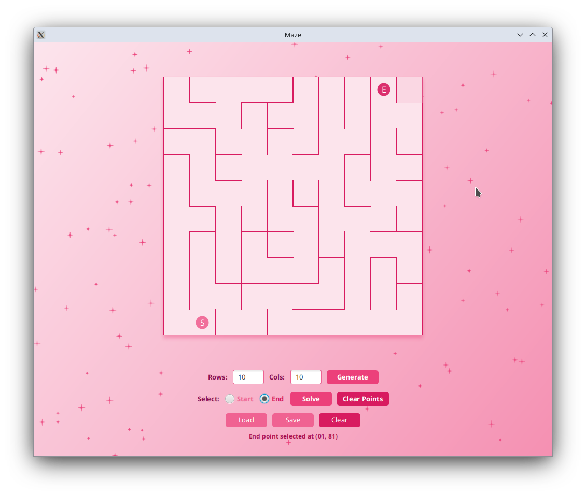
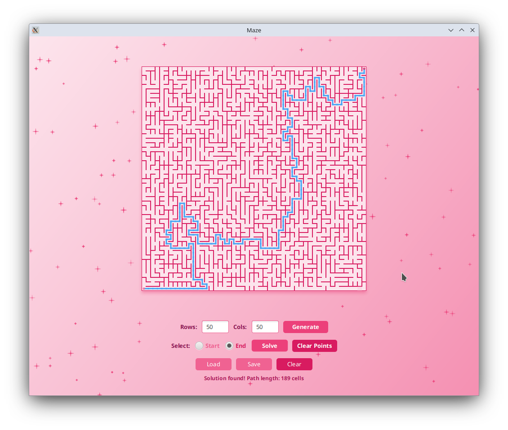

# maze-generation-and-solving

## О проекте
Проект представляет собой реализацию генерации и визуализации идеальных лабиринтов с возможностью поиска кратчайшего пути. 
Проект разработан на языке Java с использованием графического пользовательского интерфейса на базе JavaFX.

## Функционал
1. Загрузка и отображение лабиринта
- Загрузка лабиринта из файла в специальном формате (описание ниже)
- Отрисовка лабиринта на экране в поле 500×500 пикселей
2. Генерация идепльного лабиринта
- Реализована генерация идеального лабиринта по алгоритму Эллера
- Гарантируется отсутствие изолированных областей и петель
- Из каждой точки существует ровно один путь в любую другую точку
- Пользователь указывает только размерность (строки и столбцы)
3. Решение лабиринта
- Реализация алгоритма BFS (поиск в ширину) для нахождения кратчайшего пути
- Пользователь выбирает начальную и конечную точки кликом по ячейкам

## Архитектура проекта
Проект построен на архитектуре MVC (Model-View-Controller):
Модель (Model)
- Maze — основная модель лабиринта
- PointMaze — точка в лабиринте
- SolutionMaze — решение лабиринта (путь)

Контроллер (Controller)
- MazeController — связывает модель и представление
- GenerationService — сервис генерации
- SolutionService — сервис решения

Представление (View)
- MainLayout — основная компоновка интерфейса
- MazeCanvas — компонент для отрисовки лабиринта
- ControlsPanel — панель управления